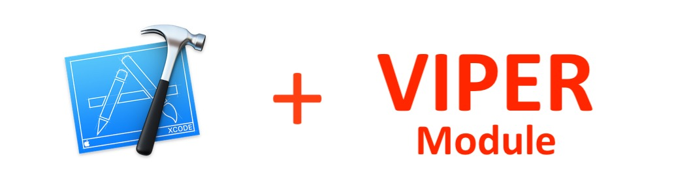

[](https://github.com/EvsenevDev/VIPERModuleTemplate/stargazers)
[](https://github.com/EvsenevDev/VIPERModuleTemplate/issues)
[](https://github.com/EvsenevDev/VIPERModuleTemplate/blob/master/LICENSE)

Once you've decided to use a VIPER architecture in your app, you shound know about the routine. For each screen/module you should create at least 6 files. Imagine that you need to create 10 modules. To avoid this boring work you can use this template which help you to generate a compete module. It's very useful for me and I hope it can be useful for you too. 

## Generated files
The template generates all files that you need to create a new VIPER module. All generated code is Swift 4 compatible.

| File Name | Acts As | Description |
| :---         |     :---      |          :--- |
| `ModuleNameViewController.swift`    | View       | UIViewController of your module.   |
| `ModuleNameInteractor.swift`    | Interactor | It's for communication with the Data Layer.      |
| `ModuleNamePresenter.swift`    | Presenter  | It's for communication with the View and the Interactor.      |
| `ModuleNameRouter.swift`    | Router     | It's for routing to other modules.    |
| `ModuleNameViewController.xib`    | ViewControllerXib | If you use xibs, you can use it for layout.   |
| `ModuleNameAssembly.swift`    |   Assembly   | It's an assembly, to build a module.    |
| `ModuleNameModuleAPI.swift`    |   API   | It's an API, a file with all protocols of your module    |

## How to install

#### Using script (easy)
Execute this command in the terminal:
```swift
sudo swift install.swift
```

You should see this output message:

`✅ VIPER Template succesfully installed.`

If it's ok, you could see your template in the Xcode.

### Manual installation
Go to Application folder, browse to the Xcode application icon. Right-click on it and choose 'Show Package Contents'. Then, browse to:
`Contents/Developer/Platforms/iPhoneOS.platform/Developer/Library/Xcode/Templates/File Templates/Architecture` and add "VIPER Module.xctemplate" file. Now you can see your template in the Xcode.


## Easy to use


## VIPER Diagram overview


## VIPER Checklist
To get started easier, we’ve prepared a check list to make sure that everything follows the VIPER’s design principle. We hope, this list will be useful for you as it is for us.

* [ ] Views and view controllers receive user interactions and pass them to presenters for decision making.
* [ ] Presenters contain the view logics and prepare content for display and reacting to user inputs.
* [ ] Presenters should not know about the existence of all UIViewControllers.
* [ ] Interactors contain business logics and they should be independent of UI.


## What is VIPER?
VIPER is not a framework, but an approach to iOS application architecture, which stands for:

#### VIEW
>View controller. It is responsible to receive user interactions and pass them to presenters for decision making. To keep the view simple, it shouldn’t contain any view logics. This is where to define how the view looks like, and nothing beyond this.

#### PRESENTER
>The presenter defines the view logics, e.g. when to show a warning message or highlight a button. It is responsible to prepare content for the view to display. Whenever data is required, the presenter requests data from interactors (but not directly from the model).

#### INTERACTOR
>The interactor mainly contains business logic, e.g. logging in the user /  processing a purchase / sending a friend request. It should be independent of the UI. It only handles requests from the presenter and prepare corresponding data regardless of how the view looks like.

#### ROUTER
>Router defines the routes from one screen to another. In VIPER, the responsibility for Routing is shared between the presenter and the wireframe.
When the presenter receives user interactions and decided to navigate to another screen, it will use the wireframe to perform the desired navigation (to which screen and how to navigate). The wireframe can also contain transition animations.

#### ASSEMBLY
>Assembly builds the modules with inpurt params and links all layers. Should connect Presenter with View, Router and Interactor, Interactor with Presenter, View with Presener. Should setup input data of module and can return module Input if needed.

## Why VIPER?
After using VIPER, I've found it to be very beneficial in many ways. Let’s get back to the list of things we set out to accomplish when architecting our app to see if VIPER addresses them.

- Single responsibility principles applied.
- Easy to iterate on.
- Collaboration friendly.
- Separated out concerns.
- Spec-ability.
- Testability. 

## Next steps

Would you like to decide what the next feature will be?
* [ ] Storyboard support
* [ ] Separated iPhone & iPad UIs

## References
- [iOS Architecture Patterns](https://medium.com/ios-os-x-development/ios-architecture-patterns-ecba4c38de52#.ba7q8dcih)
- [#8 VIPER to be or not to be?](https://swifting.io/blog/2016/03/07/8-viper-to-be-or-not-to-be/)
- [https://www.objc.io/issues/13-architecture/viper/](https://www.objc.io/issues/13-architecture/viper/)
- [https://www.ckl.io/blog/ios-project-architecture-using-viper/](https://www.ckl.io/blog/ios-project-architecture-using-viper/)

## Contribute
This is an open source project, so feel free to contribute.
- Open an [issue](https://github.com/EvsenevDev/VIPERModuleTemplate/issues/new).

----


## Authors

* [Bogdan Evsenev](https://twitter.com/BED_Code)
